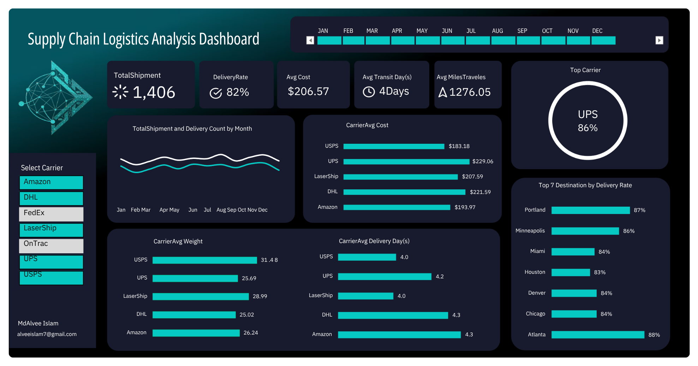

# Supply Chain Logistics Analysis | Excel

## **Project Overview**
This project delivers an end-to-end analysis of a supply chain logistics operation, transforming raw shipment data into an interactive Excel dashboard. The goal was to monitor carrier performance, delivery efficiency, and shipment costs to help logistics managers optimize routes, reduce transit delays, and improve overall service quality.

The dashboard consolidates **1,406 shipments** across multiple carriers and destinations, providing a clear view of operational KPIs and carrier benchmarks.

---

## **Key Insights & KPIs**
The dashboard tracks the following critical logistics metrics:
* **Total Shipments:** 1,406 shipments processed across all warehouses and carriers.
* **Delivery Rate:** 82% overall on-time delivery success rate.
* **Average Cost per Shipment:** $206.57 to benchmark logistics spending.
* **Average Transit Days:** 4 days from origin warehouse to destination.
* **Average Miles Traveled:** 1,276.05 miles per shipment route.
* **Top Carrier:** UPS leads with an 86% performance score.
* **Top Destinations:** Ranking of the top 7 cities (Portland, Minneapolis, Miami, etc.) by delivery success rate.

---

## **Domain Knowledge Applied**
To ensure the dashboard drives actionable operational value, the following supply chain principles were integrated:
* **Carrier Performance Management:** Comparing carriers (UPS, DHL, FedEx, USPS, LaserShip, OnTrac, Amazon) across cost, weight capacity, and transit efficiency.
* **Route Optimization:** Analyzing distance vs. transit days to identify bottlenecks and underperforming lanes.
* **Cost-to-Serve Analysis:** Evaluating average shipment cost by carrier to optimize vendor selection.
* **Service Level Monitoring:** Tracking Delivered, Delayed, Lost, Returned, and In Transit statuses to measure service reliability.
* **Destination Profiling:** Identifying high-performing and problematic destination cities for targeted improvements.

---

## **Technical Skills Demonstrated**
* **Data Cleaning:** Standardized raw shipment records, handled missing values, and formatted dates using Excel functions.
* **Pivot Tables & Charts:** Built complex pivot architectures to aggregate shipments by carrier, month, and destination.
* **Advanced Formulas:** Implemented logic for Delivery Rate %, Average Cost, Transit Days, and dynamic Top N destination rankings using formulas like `COUNTIFS`, `AVERAGEIFS`, `SUMIFS`, and `LARGE`.
* **Interactive Slicers:** Enabled dynamic filtering by **Carrier** and **Month** for real-time exploration.
* **Dashboard Design:** Created a clean, professional dark-themed user interface with custom KPI cards, bar charts, line charts, and a donut chart for the top carrier.

---

## **Interactive Visuals**
* **Executive KPI Cards:** High-level metrics for Total Shipments, Delivery Rate, Avg Cost, Transit Days, and Miles Traveled.
* **Trend Line Chart:** Total Shipment vs. Delivery Count by Month to identify seasonal patterns.
* **Carrier Comparison Bars:** Side-by-side benchmarking of Avg Cost, Avg Weight, and Avg Delivery Days across all carriers.
* **Top Carrier Donut:** Dynamic visual highlighting the leading carrier by performance.
* **Destination Ranking:** Top 7 destination cities ranked by delivery success rate.
* **Interactive Slicers:** Multi-dimensional filtering by **Carrier** and **Month** for granular exploration.

---

## **Dataset Overview**
The dataset contains detailed shipment records with the following fields:
* **Shipment ID** — Unique identifier for each shipment
* **Origin Warehouse** — Source location (MIA, LA, BOS, SF, ATL, CHI, HOU, SEA, NYC, DEN)
* **Destination** — Delivery city
* **Carrier** — Shipping provider (UPS, DHL, FedEx, USPS, LaserShip, OnTrac, Amazon)
* **Shipment Date & Delivery Date** — Timestamps for transit calculation
* **Weight (kg), Cost ($), Distance (miles), Transit Days**
* **Status** — Delivered, Delayed, Lost, Returned, In Transit

---

## **How to Explore**
1. **Download:** Clone the repository or download the `supply-chain-logistics-analysis.xlsx` file.
2. **Open:** Open the file in Microsoft Excel (Click **"Enable Content"** if prompted).
3. **Interact:** Use the **Carrier slicer** and **Month timeline** to filter the dashboard dynamically.
4. **Analyze:** Compare carrier performance metrics to identify the most cost-effective and reliable shipping partners.

---
*Created by Md Alvee Islam as part of a Data Analytics Portfolio to demonstrate proficiency in Logistics & Operations Analytics.*
